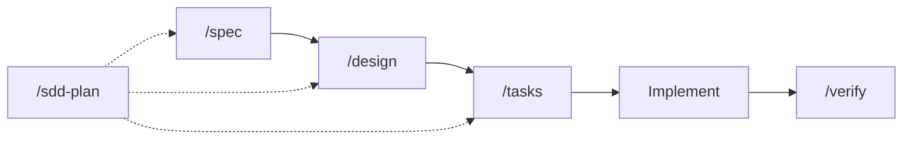

# SpecDev Cursor Plugin — Agent Overview

Cursor rules (`.mdc`) and slash **commands** for **Spec-Driven Development (SDD)** inspired by Kiro.

## Phased workflow

```text
Requirements (EARS) → Architecture & design → Task planning → Implementation → Verification
```

Spec artifacts: `.specdev/specs/<feature-name>/` → `requirements.md`, `design.md`, `tasks.md`.



## Slash commands

Run in Cursor Agent chat. Shipped in `commands/` (plugin) and `.cursor/commands/` (this repo).

| Command | Phase | Agent rule |
| --- | --- | --- |
| `/sdd-init` | Setup | Scaffold `.specdev/specs/` |
| `/sdd-plan <idea>` | Orchestrator | Full workflow with approval gates |
| `/spec <idea>` | Requirements | `requirements-agent.mdc` |
| `/design <feature>` | Design | `design-agent.mdc` |
| `/tasks <feature>` | Tasks | `task-planner.mdc` |
| `/verify <feature>` | Verification | `verifier-agent.mdc` |

**Typical flow:** `/sdd-init` → `/sdd-plan my feature` *or* `/spec` → `/design` → `/tasks` → implement one task at a time → `/verify`.

## Rules (agents)

| Rule file | Phase | Apply mode |
| --- | --- | --- |
| `core-sdd.mdc` | Foundation | **Always apply** |
| `rule-generator.mdc` | Bootstrap / meta | Intelligent + `**/*.mdc` globs |
| `requirements-agent.mdc` | Requirements | Intelligent + `.specdev` globs |
| `design-agent.mdc` | Design | Intelligent + `.specdev` globs |
| `task-planner.mdc` | Tasks | Intelligent + `.specdev` globs |
| `verifier-agent.mdc` | Verification | Intelligent + `.specdev` / test globs |

## Repository layout (plugin)

| Path | Purpose |
| --- | --- |
| `rules/` | Shipped rules (`.cursor-plugin/plugin.json`) |
| `commands/` | Shipped slash commands |
| `.cursor/rules/` | Dogfood rules (keep in sync with `rules/`) |
| `.cursor/commands/` | Dogfood commands (keep in sync with `commands/`) |
| `.specdev-templates/` | Copied into workspace by `/sdd-init` |

When editing plugin commands or rules, update **both** shipped and `.cursor/` copies.

## Phase 1 — Foundation

- **`core-sdd.mdc`** — spec truth, EARS, phase gates, spec–code sync
- **`rule-generator.mdc`** — `/create-rule [name]` to author other rules

## Phase 2 — Feature specs

Use slash commands or @-mention phase agents directly.

## License

MIT — see [LICENSE](LICENSE).
